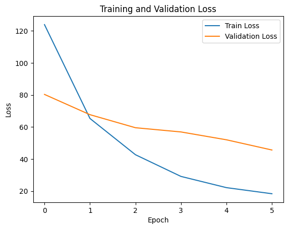
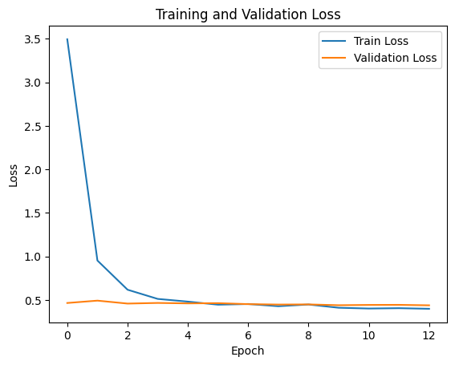
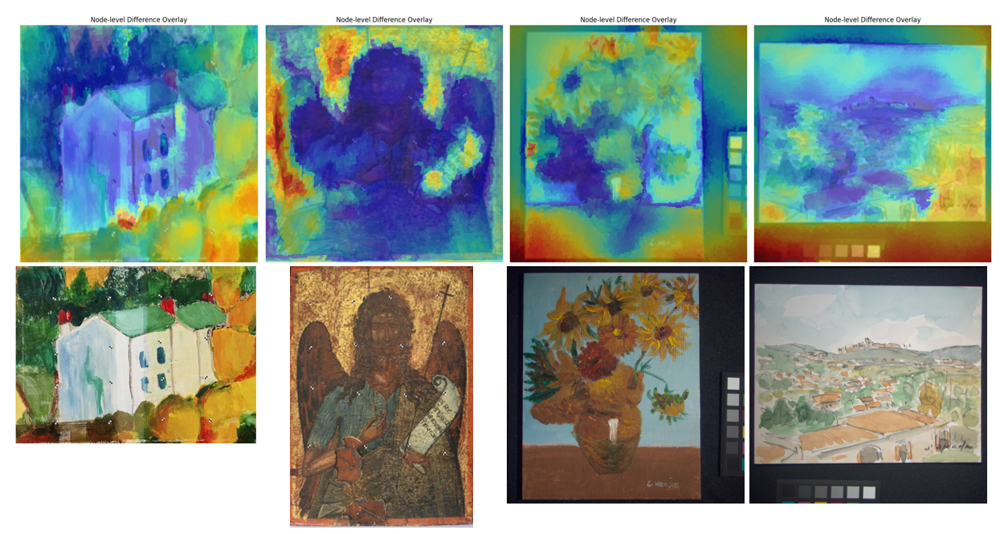

# ArtExtract 🎨 

### 1. Project overview


The ArtExtract project aims to develop an artificial intelligence model for detecting hidden artworks beneath canvases. By building upon the high-quality dataset from last year's project outcomes, this initiative employs a more advanced Siamese network to uncover additional information about concealed paintings. Through its innovative technology, the project offers a novel perspective to the field of art conservation.

### 2. Model Structure

#### A. Based-GCN Siamese Network Architecture

**Graph Convolutional Networks (GCN)** are designed to directly process irregular, non-grid data such as 3D meshes and social networks. They leverage external knowledge transfer to reduce dependence on training samples and improve computational efficiency (Gao, Zhang et al. 2019; Qi, Yang et al. 2020; Yang and Lee 2020).

Our model adopts a classic Siamese architecture with a backbone composed of stacked **GCN blocks**, each including a GCN layer, normalization, and LeakyReLU activation, enabling multi-level extraction of local and global graph features. Two parameter-shared branches independently process superpixel-based graph representations, and similarity is measured by the Euclidean distance between their output embeddings.

During training, an unsupervised contrastive loss encourages embeddings of similar image pairs (e.g., original painting and multispectral version) to be close while pushing dissimilar pairs apart, enhancing the model’s discriminative power.

#### B. Based-GAT Siamese Network Architecture

**Graph Attention Networks (GAT)** were introduced to overcome limitations of GCN by assigning adaptive weights to neighboring nodes via an attention mechanism. Unlike GCN which treat neighbors uniformly, GAT learns the relative importance of each neighbor during training. Moreover, GATs do not require full knowledge of the graph structure beforehand, enabling effective inductive learning on unseen graphs (Veličković, Cucurull et al. 2017).

Our **Based-GAT Siamese Network** maintains the same overall architecture as the Based-GCN, replacing only the backbone with a three-layer GAT. Experiments showed that GAT outperforms GCN with the same depth and similar parameters, leading us to focus on fine-tuning GAT’s hyperparameters, which differ slightly from those of GCN.

#### C. Loss Function : Unsupervised Contrastive Loss
During training, an unsupervised contrastive loss encourages the model to learn embeddings that maintain similarity between related image pairs (e.g., original painting and multispectral version) by pulling them closer in the embedding space while pushing unrelated pairs apart. This loss function enhances the model’s ability to preserve subtle structural relationships and improve discrimination between similar and dissimilar inputs.

### 3. Dataset
**The dataset used in this project is entirely derived from the previous year’s established results.**

| Data  | CAVE  | Harvard |MSI |Total  GT Image | Multispectral Masks|
| ------------| ------------- |------------- |  ------------- |------------- |------------- |
|Train|25|77|0|102|102*8|
|Val|2|0|2|4|4*8|

- Dataset Structure
 ```               
├── train 
│   │
│   ├── rgb_images  # RGB images for training including objects and scenaries                      
│   └── ms_masks    # 8 multispectral images per 1 rgb image
└── val 
    ├── rgb_images  # Allocated painting image                       
    └── ms_masks  
```

Download train/val dataset used for the study [here.](https://drive.google.com/drive/folders/1tW_GlgvikZlo6fHXr8Sjq1yrLTHw4tSz?usp=share_link)

### 4. Results
#### Evaluation Metrics
- **Unsupervised Contrastive Loss**

| Model  | Training Loss | Validation Loss |
| ------------| ------------- | ------------- |
|Based-GCN Siamese Network	| 18.3417 | 45.6465 |
|Based-GAT Siamese Network	| 0.3994 | 0.4392 |

<table>
  <tr>
    <td>
      
      <p style="text-align:center;">Based-GCN Siamese Network Loss</p>
    </td>
    <td>
      
      <p style="text-align:center;">Based-GAT Siamese Network Loss</p>
    </td>
  </tr>
</table>

The loss curves for both models show that the **Based-GAT Siamese Network** achieves significantly lower training and validation losses compared to the Based-GCN counterpart. **This indicates that the GAT model converges more efficiently and generalizes better on the validation data.**

Due to its superior performance and stability during training, the Based-GAT Siamese Network was selected as the primary model for subsequent inference and visualization tasks.

#### Hidden Painting Extraction

In the final phase of our project, we leverage the trained Based-GAT Siamese Network to perform inference on pairs of painting images, aiming to quantitatively and qualitatively analyze their similarity. For each pair, the network generates embedding vectors.

Beyond numerical similarity scores, we extract attention weights assigned to nodes (superpixel regions) within the graph representation. These weights highlight which regions contribute most significantly to the model’s similarity assessment, enabling a fine-grained understanding of the model’s focus.

To visualize these insights, the attention-derived importance scores are mapped as color-coded heatmaps overlaid on the original images. **Blue regions indicate areas of strong similarity, while red regions mark significant differences.** This visualization technique helps reveal subtle, often hidden, structural or material features beneath the visible surface of paintings that may be imperceptible to the naked eye.

Such interpretable visualizations serve multiple purposes: they validate and explain model decisions, expose potential shortcomings or biases, and provide invaluable tools for art historians and conservators. By uncovering hidden layers and features through multispectral imaging combined with graph-based analysis, these visualizations support restoration, authentication, and scholarly research.

### 5. Implementation guidance

This project is organized into several key directories and scripts to facilitate modular development and easy navigation:

- model/ — Contains the core model definitions, including the main network architecture implemented in extract_model.py.

- utils/ — Utility scripts for graph construction (build_graph.py), data preprocessing (data_graph.py), and visualization (visualization.py).

- jupyter/ — Jupyter notebooks for exploratory data analysis and experimentation (e.g., test.ipynb).

Additional standalone scripts include:

- train.py — The training pipeline for model optimization.

- inference.py — Scripts for running inference on test data.

### 6. Citations
```
[1] Achanta, R., Shaji, A., Smith, K., Lucchi, A., Fua, P., & Süsstrunk, S. (2012). SLIC superpixels compared to state-of-the-art superpixel methods. IEEE Transactions on Pattern Analysis and Machine Intelligence, 34(11), 2274–2282.

[2] Gao, J., Zhang, T., & Xu, C. (2019). Graph convolutional tracking. In Proceedings of the IEEE/CVF Conference on Computer Vision and Pattern Recognition (pp. 4649–4659).

[3] Ghojogh, B., Sikaroudi, M., Shafiei, S., Tizhoosh, H. R., Karray, F., & Crowley, M. (2020, July). Fisher discriminant triplet and contrastive losses for training siamese networks. In 2020 International Joint Conference on Neural Networks (IJCNN) (pp. 1–7). IEEE.

[4] Gong, Z., Wang, L., Yu, L., & Shi, Z. (2022). Superpixel spectral–spatial feature fusion graph convolution network for hyperspectral image classification. IEEE Transactions on Geoscience and Remote Sensing, 60, 1–16.

[5] Qi, F., Yang, X., & Xu, C. (2020). Emotion knowledge driven video highlight detection. IEEE Transactions on Multimedia, 23, 3999–4013.

[6] Trémeau, A., & Colantoni, P. (2000). Regions adjacency graph applied to color image segmentation. IEEE Transactions on Image Processing, 9(4), 735–744.

[7] Veličković, P., Cucurull, G., Casanova, A., Romero, A., Lio, P., & Bengio, Y. (2017). Graph attention networks. arXiv preprint arXiv:1710.10903.
```

Find out more about the project on this [blog](https://medium.com/@jimmy454522)