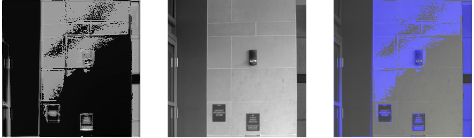

## ArtExtract 🎨 

#### 1. Project overview
The ArtExtract project leverages machine learning to revolutionize art conservation by uncovering hidden paintings through multispectral imaging. By creating a comprehensive dataset of multispectral images of paintings, the project aims to develop an AI model capable of detecting hidden artworks behind the canvas. The project's innovative techniques could lead to significant discoveries in art history. Initially, the focus is on generating high-quality multispectral images from RGB images, addressing the challenges and strategic approaches needed to achieve this goal.

#### 2. Model Structure
<!-- Model architecture image and explanation will be added -->
2.1 Multispectral Image (MSI) Generation 


2.2 Hidden Painting Extraction


#### 3. Dataset 
| Dataset  | Info | Link |
| ------------- | ------------- |------------- |
| CAVE  | 32 scenes with full spectral resolution reflectance data from 400-700nm at 10nm intervals | [Link](https://www.cs.columbia.edu/CAVE/databases/multispectral/)  |
| Harvard | 50 indoor and outdoor images, with 25 images featuring mixed illumination  | [Link](https://vision.seas.harvard.edu/hyperspec/d2x5g3/)  |
| Multispectral Imaging (MSI) | 2 mock-up paintings with multispectral data at 360–1150 nm intervals| [Link](https://projects.ics.forth.gr/cvrl/msi/)  |

Among the multispectral dataset mixed with different objects, we chose painting images as a validation dataset to verify its robust performance to align with our reserach objectives.

| Data  | CAVE  | Harvard |MSI |Total  GT Image | Multispectral Masks|
| ------------| ------------- |------------- |  ------------- |------------- |------------- |
|Train|25|77|0|102|102*8|
|Val|2|0|2|4|4*8|

To overcome the limited training dataset, we created [patchify.py](utils/patchify.py), which divides a single image into 4 smaller patches. This process increases the size of the training dataset by a factor of 4, effectively augmenting the existing data and enhancing the model's training potential.


- Dataset Structure
 ```               
├── train 
│   │
│   ├── rgb_images  # RGB images for training including objects and scenaries                      
│   └── ms_masks    # 8 multispectral images per 1 rgb image
└── val 
    ├── rgb_images  # Allocated painting image                       
    └── ms_masks  
```

Download train/val dataset used for the study [here.](https://drive.google.com/drive/folders/1tW_GlgvikZlo6fHXr8Sjq1yrLTHw4tSz?usp=share_link)

#### 4. Results
4.1 Quantitative Analysis

These results are based on the patchified training dataset due to the limited availability of validation data, which is insufficient to fully demonstrate the model's robustness on the painting dataset.

| Model  | PSNR  | LPIPS |SSIM |
| ------------| ------------- |------------- |  ------------- |
|SimplyUNet  |0.0201	|14.4565|	0.4936|
|SparseNet|0.0032|	13.0291	|0.2910|

<!-- Explanation would be added -->

4.2 Qualitative Analysis

Instead, the generated images shown below are based on the best-performing model, selected using the saved `.pth` file with the lowest LPIPS score on the validation dataset. While there is some discrepancy between the output and the Ground Truth image (MSI) due to non-painting objects in the training data, the model effectively highlights hidden features of the painting, making them even more visible.


<!-- The demonstration using Siamese network !!!!!!!!!-->
Example of Hidden Painting Extraction Model.




#### 5. Implementation guidance

- Directories
```                
├── unets               # Collection of different UNets            
│   ├── transBlocks     # Chunks of Transformer blocks          
│   └── ..       
├── utils               # For the data loading, eval metrics and visualization, create patches
├── model.py            # Best performing model       
├── train.py            # Train, test code       
└── trainModel.ipynb    # Example 
```

Step 1. Install the required packages
```
pip install -r requirements.txt
```
We implemeted Weights & Biases (W&B) platform for easier experiment. If you are not logged in to W&B, initialise your account by entering API key after the command below. 
```
wandb login
```
Before running the ```train.py```, make sure to change the default value of the entity name. You can check your entity name below the W&B profile.
```
parser.add_argument('--entity', type=str, default='YOUR ENTITY NAME', help='W&B entity name')
```
Step 2. Train the model 
```
<!-- Example -->
python train.py --trainpath  '../train/' --valpath '../val/' -lr 0.02 -e 100
```

#### 6. Citations
```
T. Zeng, C. Diao and D. Lu, "U-Net-Based Multispectral Image Generation From an RGB Image," in IEEE Access, vol. 9, pp. 43387-43396, 2021, doi: 10.1109/ACCESS.2021.3066472.
keywords: {Feature extraction;Spatial resolution;Neural networks;Dictionaries;Image synthesis;Image reconstruction;Training;Convolutional neural networks;multispectral image;U-Net},

@misc{xie2021segformersimpleefficientdesign,
      title={SegFormer: Simple and Efficient Design for Semantic Segmentation with Transformers}, 
      author={Enze Xie and Wenhai Wang and Zhiding Yu and Anima Anandkumar and Jose M. Alvarez and Ping Luo},
      year={2021},
      eprint={2105.15203},
      archivePrefix={arXiv},
      primaryClass={cs.CV},
      url={https://arxiv.org/abs/2105.15203}}

@misc{li2023spectralenhancedrectangletransformer,
      title={Spectral Enhanced Rectangle Transformer for Hyperspectral Image Denoising}, 
      author={Miaoyu Li and Ji Liu and Ying Fu and Yulun Zhang and Dejing Dou},
      year={2023},
      eprint={2304.00844},
      archivePrefix={arXiv},
      primaryClass={cs.CV},
      url={https://arxiv.org/abs/2304.00844}, 
}
```


Find out more about the project on this [blog]([https://medium.com/@soyoungpark.psy](https://medium.com/@soyoungpark.psy/beneath-the-canvas-discovering-hidden-art-with-ai-part1-gsoc-24-3dc499758120))! 
