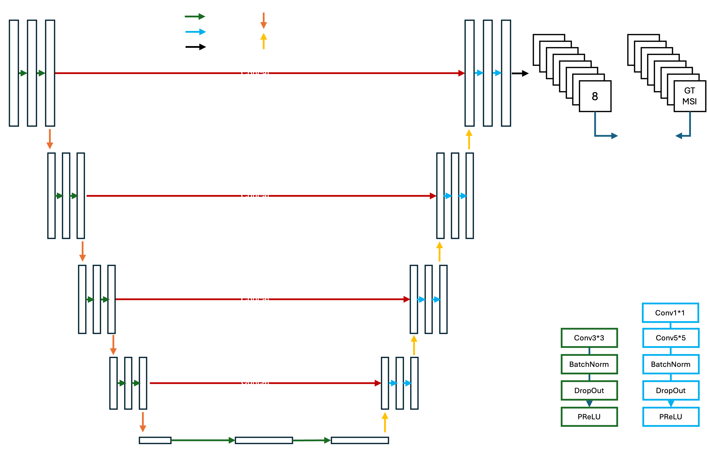
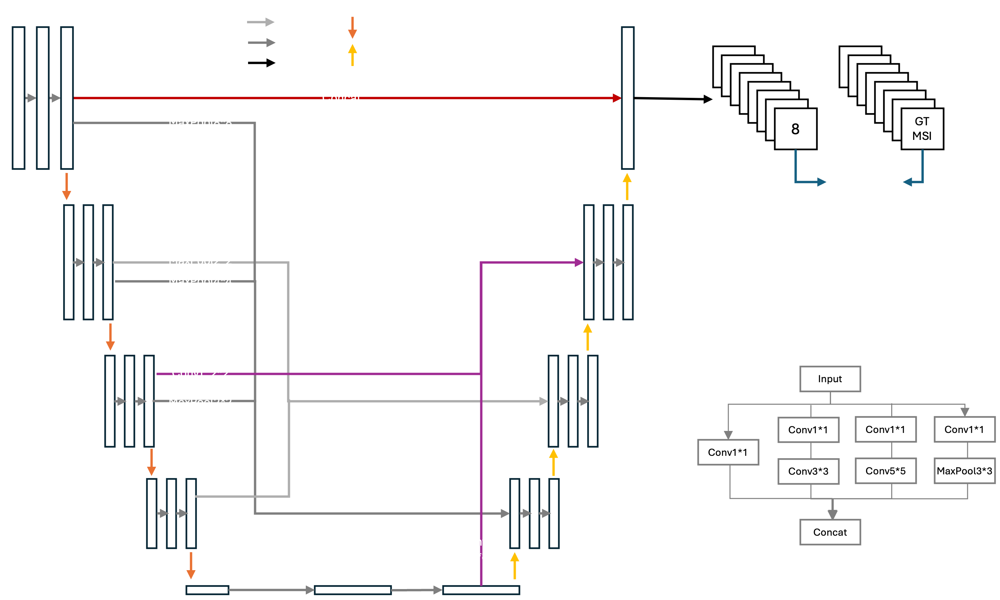
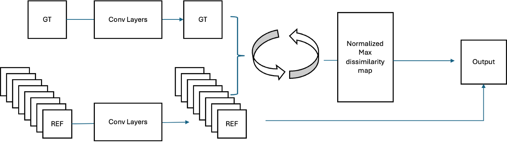
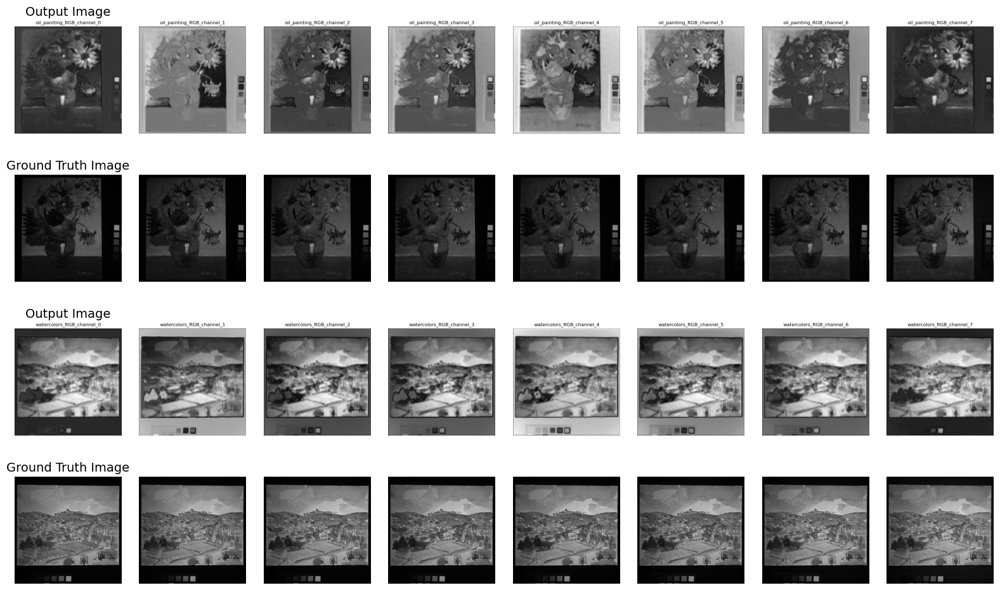
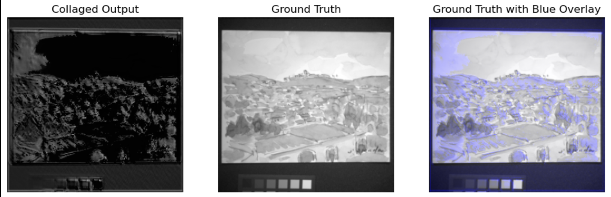

## ArtExtract 🎨 

#### 1. Project overview


The ArtExtract project leverages machine learning to revolutionize art conservation by uncovering hidden paintings through multispectral imaging. By creating a comprehensive dataset of multispectral images of paintings, the project aims to develop an AI model capable of detecting hidden artworks behind the canvas. The project's innovative techniques could lead to significant discoveries in art history. The primary goal of the project is to generate high-quality multispectral images from RGB images,and providing practical tool to extract the figure of the hidden painting.

#### 2. Model Structure
2.1 Multispectral Image (MSI) Generation 

##### A. SimplyUnet Architecture


Inspired by previous studies using U-Net-based approaches [1][2][3], we developed **SimplyUnet** for generating multispectral images from RGB input images. This model differentiates itself by simplifying the intermediate blocks and employing an asymmetrical structure for the encoder and decoder, utilizing modified Block1 and Block2, respectively. 

**SimplyUnet** is designed to dynamically capture the hidden features of the images by leveraging these architectural innovations. The simplified intermediate blocks streamline the feature extraction process, while the asymmetrical design allows for a more effective handling of the varying complexities between encoding and decoding stages. This approach not only enhances the model's ability to reveal subtle details in multispectral images but also improves computational efficiency, making it a powerful tool for applications requiring precise image analysis and feature extraction.


##### B. SparseUnet Architecture


SparseUnet draws inspiration from advancements in U-Net architectures, particularly the evolution towards more intricate and expansive connections in models like Unet++ and Unet3+. While Unet++ introduced nested and dense skip connections and Unet3+ expanded connections to a full scale, SparseUnet aims to refine this approach by incorporating sparser, intermittent connections between decoder blocks and previous layers.

The primary motivation behind SparseUnet is to minimize the loss of key features and enhance the model's ability to capture detailed features. By strategically applying sparse connections, SparseUnet seeks to balance the richness of feature propagation with computational efficiency, ultimately improving performance in complex image generation tasks.


##### C. Loss Function : Multi-Scale SSIM (MS-SSIM)

MS-SSIM (Multi-Scale Structural Similarity) is an extended version of SSIM (Structural Similarity Index) that evaluates image quality at multiple scales, allowing the model to learn and preserve details across various resolutions. By computing the SSIM score at different scales, MS-SSIM provides a more comprehensive measure of structural similarity, capturing both fine details and larger contextual information.

2.2 Hidden Painting Extraction



#### 3. Dataset 
| Dataset  | Info | Link |
| ------------- | ------------- |------------- |
| CAVE  | 32 scenes with full spectral resolution reflectance data from 400-700nm at 10nm intervals | [Link](https://www.cs.columbia.edu/CAVE/databases/multispectral/)  |
| Harvard | 50 indoor and outdoor images, with 25 images featuring mixed illumination  | [Link](https://vision.seas.harvard.edu/hyperspec/d2x5g3/)  |
| Multispectral Imaging (MSI) | 2 mock-up paintings with multispectral data at 360–1150 nm intervals| [Link](https://projects.ics.forth.gr/cvrl/msi/)  |

Among the multispectral dataset mixed with different objects, we chose painting images as a validation dataset to verify its robust performance to align with our reserach objectives.

| Data  | CAVE  | Harvard |MSI |Total  GT Image | Multispectral Masks|
| ------------| ------------- |------------- |  ------------- |------------- |------------- |
|Train|25|77|0|102|102*8|
|Val|2|0|2|4|4*8|

To overcome the limited training dataset, we created [patchify.py](utils/patchify.py), which divides a single image into 4 smaller patches. This process increases the size of the training dataset by a factor of 4, effectively augmenting the existing data and enhancing the model's training potential.


- Dataset Structure
 ```               
├── train 
│   │
│   ├── rgb_images  # RGB images for training including objects and scenaries                      
│   └── ms_masks    # 8 multispectral images per 1 rgb image
└── val 
    ├── rgb_images  # Allocated painting image                       
    └── ms_masks  
```

Download train/val dataset used for the study [here.](https://drive.google.com/drive/folders/1tW_GlgvikZlo6fHXr8Sjq1yrLTHw4tSz?usp=share_link)

#### 4. Results
4.1 Quantitative Analysis
##### Evaluation Metrics
- **LPIPS (Learned Perceptual Image Patch Similarity):** Measures perceptual similarity between images passed through pre-trained neural network to capture the detailed visual difference between the images.
- **PSNR (Peak Signal-to-Noise Ratio):** Measures image quality by comparing the maximum possible pixel value to the differences between pixels of two images, with higher values indicating better quality.
- **SSIM (Structural Similarity Index):** Evaluates the similarity between two images by comparing their luminance, contrast, and structure, suggesting comprehensive image quality assessment.


| Model  | LPIPS &#8595; | PSNR &#8593; |SSIM &#8593; |
| ------------| ------------- |------------- |  ------------- |
|SimpyUnet	|$${\color{red}0.0095}$$|$${\color{red}11.3711}$$	|0.1757|
|SparseUnet|	0.0143	|10.2455	|$${\color{red}0.2409}$$|
|[1]ImprovedUnet|	0.0133|	10.1516|	0.1559|

Our SimplyUnet model demonstrates lower LPIPS and higher PSNR compared to [1], while SparseUnet achieved better SSIM performance relative to other models. Despite the simplicity of the intermediate blocks (Block1, Block2), the superior results highlight SimplyUnet's effectiveness in generating outputs that closely resemble the ground truth multispectral image (MSI). It is interesting to observe that the SparseUnet with increased connectivity between the encoder and decoder blocks contributed to an improved SSIM score, indicating better structural preservation and feature retention in the reconstructed images.

These results are based on a training result from the patchified dataset due to the limited availability of validation data (resized to 128x128), which restricts the ability to fully demonstrate the model's robustness on the complete painting dataset. In the future, the model could be further optimized by training on the full painting dataset, tailoring it specifically for discovering hidden images. Additionally, with sufficient computational resources, training on larger image sizes could help capture more intricate details that may be lost at smaller resolutions.

4.2 Qualitative Analysis

Generated images shown below are based on the best-performing model of SimplyUnet, selected using the saved `.pth` file with the lowest LPIPS score on the validation dataset. While there is some discrepancy between the output and the Ground Truth image (MSI) due to non-painting objects in the training data, the model effectively highlights hidden features of the painting, making them even more visible.



Example. Hidden Painting Extraction Tool



This tool helps uncover hidden details in paintings by highlighting areas with the highest pixel differences across eight multispectral imaging (MSI) outputs. Designed for art historians and conservators, it provides an intuitive way to explore concealed features, such as underlying sketches or restorations. The convolutional layers can be adjusted for complexity, and the current output is thresholded at 0.7 using a normalized difference map. This approach makes it easier to analyze hidden elements in a painting, offering an efficient and accessible method for deeper art investigation and preservation.


#### 5. Implementation guidance

- Directories
```                
├── unets               # Collection of different UNets            
│   ├── transBlocks     # Chunks of Transformer blocks          
│   └── ..       
├── utils               # For the data loading, eval metrics and visualization, create patches
├── model.py            # Best performing model       
├── train.py            # Train, test code       
└── trainModel.ipynb    # Example 
```

Step 1. Install the required packages
```
pip install -r requirements.txt
```
We implemeted Weights & Biases (W&B) platform for easier experiment. If you are not logged in to W&B, initialise your account by entering API key after the command below. 
```
wandb login
```
Before running the ```train.py```, make sure to change the default value of the entity name. You can check your entity name below the W&B profile.
```
parser.add_argument('--entity', type=str, default='YOUR ENTITY NAME', help='W&B entity name')
```
Step 2. Train the model 
```
<!-- Example -->
python train.py --trainpath  '../train/' --valpath '../val/' -lr 0.02 -e 100
```

#### 6. Citations
```
[1] T. Zeng, C. Diao and D. Lu, "U-Net-Based Multispectral Image Generation From an RGB Image," in IEEE Access, vol. 9, pp. 43387-43396, 2021, doi: 10.1109/ACCESS.2021.3066472.
keywords: {Feature extraction;Spatial resolution;Neural networks;Dictionaries;Image synthesis;Image reconstruction;Training;Convolutional neural networks;multispectral image;U-Net},

[2] @misc{xie2021segformersimpleefficientdesign,
      title={SegFormer: Simple and Efficient Design for Semantic Segmentation with Transformers}, 
      author={Enze Xie and Wenhai Wang and Zhiding Yu and Anima Anandkumar and Jose M. Alvarez and Ping Luo},
      year={2021},
      eprint={2105.15203},
      archivePrefix={arXiv},
      primaryClass={cs.CV},
      url={https://arxiv.org/abs/2105.15203}}

[3] @misc{li2023spectralenhancedrectangletransformer,
      title={Spectral Enhanced Rectangle Transformer for Hyperspectral Image Denoising}, 
      author={Miaoyu Li and Ji Liu and Ying Fu and Yulun Zhang and Dejing Dou},
      year={2023},
      eprint={2304.00844},
      archivePrefix={arXiv},
      primaryClass={cs.CV},
      url={https://arxiv.org/abs/2304.00844}, 
}
```


Find out more about the project on this [blog](https://medium.com/@soyoungpark.psy)
